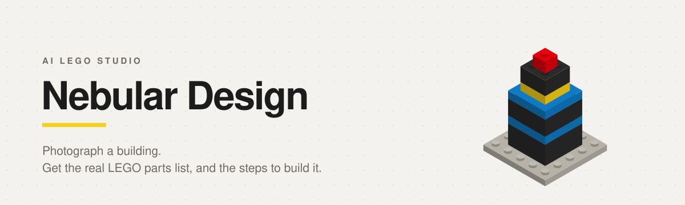
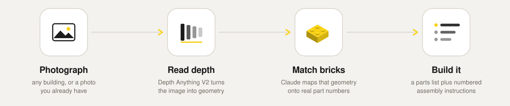

<picture>
  <source media="(prefers-color-scheme: dark)" srcset="docs/banner-dark.svg">
  
</picture>

<div align="center">


</div>

Upload a photo of a building. A depth model reads the flat image into a rough sense of its geometry,
Claude maps that geometry onto real LEGO part numbers, and you get back a parts list with numbered
assembly steps. Every build is saved to your profile, and there is a public chat room plus
friend-to-friend messages so builders can compare notes on the same structure.

<picture>
  <source media="(prefers-color-scheme: dark)" srcset="docs/pipeline-dark.svg">
  
</picture>

The depth model loads once into a thread pool, so a cold first request pays the model load and every
request after it stays off the event loop. When `ANTHROPIC_API_KEY` is missing, or the Claude call
fails, brick matching returns a bundled sample build instead of erroring, which keeps the whole
upload flow clickable without a key.

## Screenshots

<!-- SCREENSHOT SLOTS. Drop your own PNGs into docs/screenshots/ and swap each src below.
     Suggested width 1200px, any 16:10-ish crop.
       upload.png        the drag-and-drop upload panel
       parts.png         the result view: parts list, colour palette, total pieces
       instructions.png  the numbered build steps
       community.png     the chat room or a DM thread -->

| Upload | Parts list |
| :---: | :---: |
|  |  |
| **Build steps** | **Community** |
|  |  |

## Stack

| Layer | What runs there |
| --- | --- |
| Frontend | Next.js 16 App Router, React 19, Tailwind CSS v4, Framer Motion, react-dropzone |
| Backend | FastAPI, SQLAlchemy 2 async, PostgreSQL over asyncpg, WebSockets for chat and DMs |
| Vision | `depth-anything/Depth-Anything-V2-Small-hf` through Transformers, on CPU |
| Reasoning | Claude (`claude-sonnet-4-6`) for part matching and step generation |
| Auth | JWT via python-jose, bcrypt password hashing |
| Files | S3 when `USE_S3=true`, otherwise written to `backend/uploads` and served at `/static` |
| Deploy | Vercel for the frontend, Railway for the API |

## Run it locally

Node 20 or newer, Python 3.12 or newer, and a PostgreSQL database.

**Backend**

```bash
cd backend
python -m venv .venv && source .venv/bin/activate
pip install -r requirements.txt
cp .env.example .env          # fill in DATABASE_URL and ANTHROPIC_API_KEY
python run.py                 # http://localhost:8000, interactive docs at /docs
```

**Frontend**

```bash
cd nebular-design
npm install
npm run dev                   # http://localhost:3000
```

Tables are created on startup, so an empty database is fine. Point the frontend at a non-default API
host with `NEXT_PUBLIC_API_URL`.

### Environment

| Variable | Default | Why you would change it |
| --- | --- | --- |
| `DATABASE_URL` | local `nebulardb` | `postgres://` and `postgresql://` are rewritten to asyncpg automatically |
| `SECRET_KEY` | dev placeholder | must be a long random string in production |
| `ANTHROPIC_API_KEY` | empty | without it, brick matching falls back to a bundled sample build |
| `ENABLE_DEPTH_ESTIMATION` | `true` | set `false` to skip the model download in CI or low-memory environments |
| `USE_S3` | `false` | `true` to store uploads in `S3_BUCKET_NAME` instead of on disk |
| `FRONTEND_URL` | `http://localhost:3000` | comma-separated list of allowed CORS origins |

## API

Everything lives under `/api`. Interactive docs are at `/docs` once the backend is up.

| Method | Route | What it does |
| --- | --- | --- |
| `POST` | `/api/auth/register` | create an account, returns a JWT |
| `POST` | `/api/auth/login` | exchange credentials for a JWT |
| `POST` | `/api/images/upload` | upload a photo and kick off the depth plus brick pipeline |
| `GET` | `/api/images/status/{project_id}` | poll one build for progress and results |
| `GET` | `/api/images/history` | every build the signed-in user has made |
| `POST` | `/api/friends/request` | send a friend request |
| `POST` | `/api/friends/accept/{friendship_id}` | accept one |
| `GET` | `/api/chat/messages` | recent public chat-room history |
| `WS` | `/api/chat/ws/chatroom` | live public chat room |
| `WS` | `/api/dm/ws/dm/{friend_id}` | live direct messages with one friend |

## Repository layout

```
backend/
  app/routers/        auth, images, friends, chat, dm
  app/services/       depth.py (Depth Anything), bricks.py (Claude), s3.py
  app/models.py       users, projects, friendships, messages
  run.py              uvicorn entrypoint
nebular-design/
  src/app/            upload, profile, chat, dm, login, register
  src/components/     Navbar, Bricks
  src/lib/api.ts      typed fetch wrapper, JWT from localStorage
docs/                 README artwork and screenshots
plan.txt              the original scope, user stories, acceptance criteria
```

## Status

The full path from photo to parts list to build steps runs end to end, along with accounts, build
history, the public chat room, friends, and DMs. Rough edges worth naming:

- Depth estimation runs on CPU, so the first upload after a cold start is slow while the model loads.
- Part matching is only as good as the model's LEGO knowledge. Part numbers are plausible rather than
  verified against a live catalogue.
- There is no 3D preview yet. The output is a parts list plus written steps, which was the deliberate
  scope cut in `plan.txt`.
