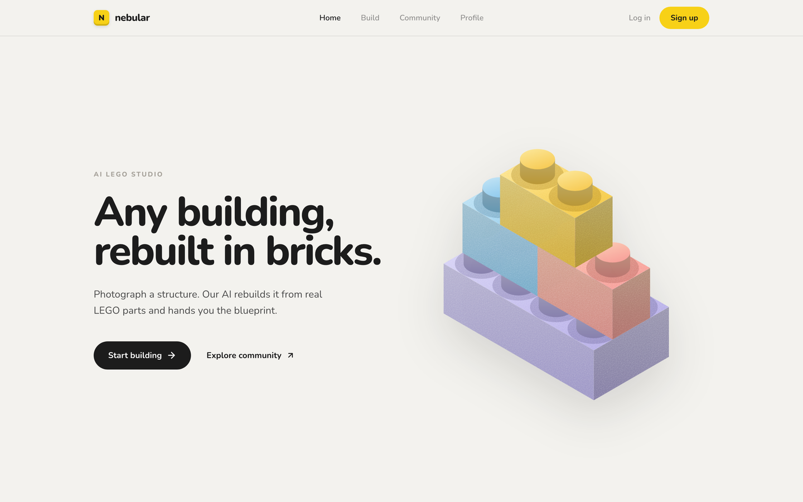
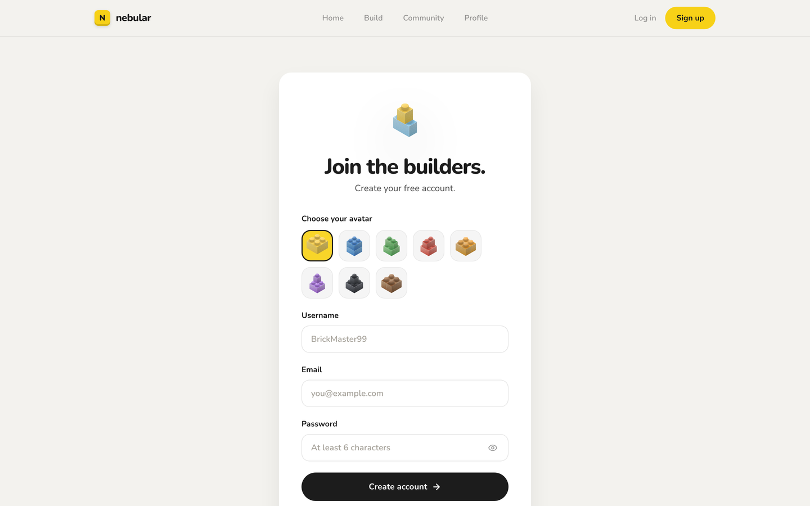

<picture>
  <source media="(prefers-color-scheme: dark)" srcset="docs/banner-dark.svg">
  
</picture>

<div align="center">

### [→ Try it live](https://nebular-design.vercel.app)

**It's free, it's up, go throw a photo of a building at it and see what comes back.**
Sign up takes ten seconds and there is no email to confirm. Have fun with it.

<br>




</div>

Upload a photo of a building. A depth model reads the flat image into a rough sense of its geometry,
a segmentation model decides which pixels are actually the building, and the two together are turned
into a standing model built in courses of real LEGO parts — with a parts list, a colour palette,
numbered assembly steps, and a 3D preview you can spin and replay course by course.

**Every part number, quantity, colour and coordinate is computed, not guessed.** Claude reads the
photograph too, but only to name the building and write the step titles. It is not allowed to touch a
number.

<picture>
  <source media="(prefers-color-scheme: dark)" srcset="docs/pipeline-dark.svg">
  
</picture>

## What it actually produces

Tower Bridge, from one photograph: **644 pieces, 51 × 27 × 2 cm**, chosen out of 72 candidate builds
by a scorer that renders each one and compares it against the source.

Whatever building you upload, what comes back is the same shape of thing: a buildable LEGO version of
it — the real parts list with quantities and colours, the whole model broken into numbered assembly
steps you can follow course by course, a 3D preview you can spin, and an `.ldr` file that opens in
BrickLink Studio if you want to take it further.

## How it decides

The interesting part is the loop, not the model.

**Search.** 72 candidates per photo, across stud resolution, relief depth, palette size, dithering and
corbelling. Each is built, rendered, and scored. The best settings are wildly different from photo to
photo, which is why they are searched for rather than configured.

**Score.** Colour distance is CIEDE2000, measured at two scales at once — per cell and over a local
neighbourhood. Per-cell alone rejected dithering outright, because dithering deliberately makes single
cells wrong so that local averages come out right. A metric that cannot see a technique's benefit will
always vote against it.

**Multiply, don't weight.** Buildability and piece count are multipliers on the final score, not
weighted terms. As terms, a model with thirty floating spans scored a couple of percent below one that
stands up, and the search happily picked it for a marginal colour win. A model that will not stand is
not a slightly worse model.

**Refine.** The worst-scoring regions get extra palette weight and the build is recomputed. A round
that does not improve the score is thrown away and logged as thrown away — the only way to tell a loop
that helped from one that merely ran.

## The brick library is measured, not remembered

230 parts, with geometry read directly out of the official LDraw part files by
`backend/scripts/measure_ldraw.py`, filtered by how often each appears across 1,547,624 rows of
Rebrickable set inventory. Slopes, arches, wedges, cones, curved and round parts, tiles and panels.

This was rebuilt from measurement after several rounds of trusting recalled dimensions, which produced
slopes that read as flat and tiles at half their real height. Both were invisible until the geometry
was sampled where the geometry actually is: LDraw has no single origin convention, so a part's
dimensions cannot be inferred from its bounding box alone.

## Screenshots

| Home | Sign up |
| :---: | :---: |
|  |  |

## Stack

| Layer | What runs there |
| --- | --- |
| Frontend | Next.js 16 App Router, React 19, Tailwind CSS v4, three.js with the LDraw loader |
| Backend | FastAPI, SQLAlchemy 2 async, PostgreSQL over asyncpg, WebSockets for chat and DMs |
| Vision | `Depth-Anything-V2-Small` and `SegFormer-B0` through Transformers, on CPU |
| Geometry | NumPy — courses, slopes, glazing, corbelling, structural checks, LDraw emission |
| Reasoning | Claude (`claude-sonnet-5`) for the building's name and step titles. Prose only |
| Auth | JWT via python-jose, bcrypt hashing, token revocation, per-IP and per-account rate limits |
| Storage | Cloudflare R2 (S3 API) for photos, renders and models; local disk when unconfigured |
| Deploy | Vercel for the frontend, Fly.io for the API, Neon for Postgres |

## Run it locally

Node 20 or newer, Python 3.12 or newer, and a PostgreSQL database.

```bash
cd backend
python -m venv .venv && source .venv/bin/activate
pip install -r requirements.txt
cp .env.example .env          # every setting is listed there, with a note on what it does
python run.py                 # http://localhost:8000
```

```bash
cd nebular-design
npm install
npm run dev                   # http://localhost:3000
```

Tables are created on startup, so an empty database is fine. Docker is what actually ships: the image
bakes both vision models in and *runs* them during the build, so a version mismatch fails the build
rather than a production request.

## Repository layout

```
backend/
  app/routers/         auth, images, friends, chat, dm
  app/services/
    legolize.py        the pipeline: courses, colour, slopes, structure, search, refinement
    score.py           CIEDE2000 at two scales, buildability, size
    lego_shapes.py     230 parts, generated from measured LDraw geometry
    ldraw.py           emit a .ldr the viewer and BrickLink Studio both read
    depth.py           Depth Anything V2
    segment.py         SegFormer / ADE20K
    bricks.py          the one Claude call
    storage.py         R2 / S3 / local disk
  scripts/             measure_ldraw.py, build_shape_library.py, prefetch_models.py
  Dockerfile           models baked in, so a cold start is seconds not a download
  fly.toml             2 GB, scale-to-zero
nebular-design/
  src/app/             upload, build/[id], profile, chat, dm, login, register
  src/components/      LegoViewer (three.js + LDraw), BuildDetail, Bricks
documentation/         architecture, flows, permissions, environment variables
```
